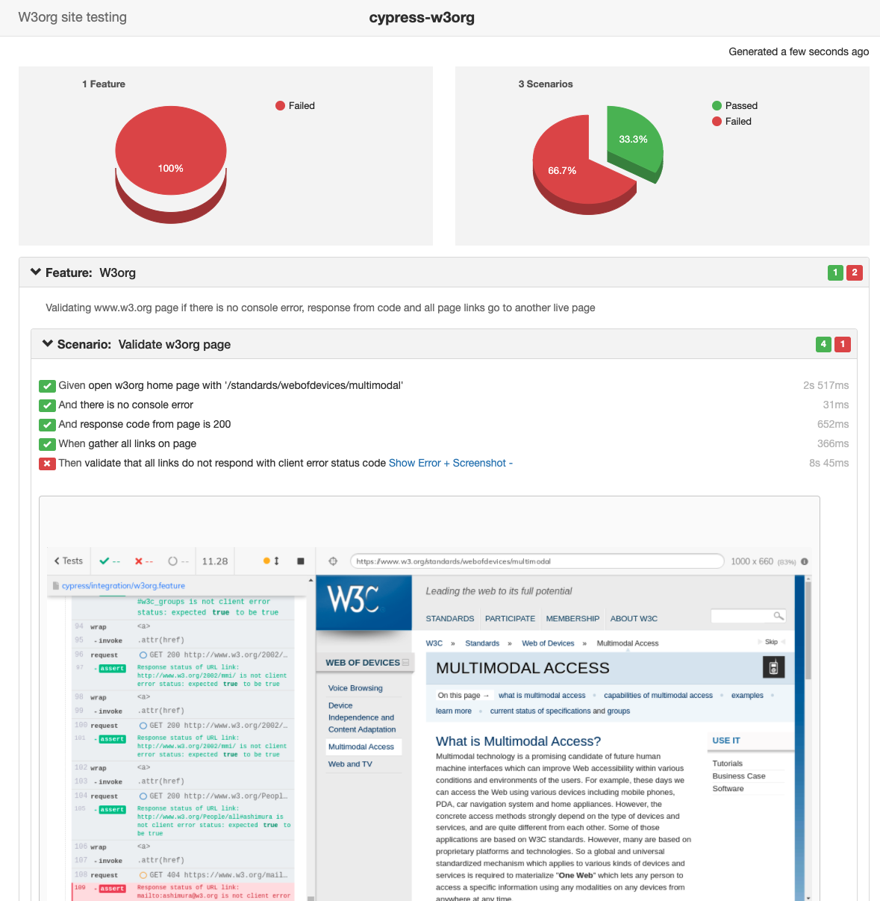

# cypress-w3org-tests
## Test scenario
Simple test scenario for browsing w3.org site and validating following:  
* Check if there is no console errors after page is loaded  
* Assert expected response code from the page  
* Gather all page links and check that their response code status is not client error code [400-499]
## Prerequisites

* [Node.js](https://nodejs.org/en/download/)
* [Docker for Desktop](https://www.docker.com/get-started)   

## Running tests

### Running tests locally

1. Open terminal at root folder
2. Install all dependencies `yarn` or `yarn install`
3. Run cypress tests: `yarn run cy:run:chrome` for chrome browser or `yarn run cy:run:firefox` for firefox browser
4. After test execution is completed there will be cucumber report generated with message:     
`🚀 Cucumber HTML report reports/cucumber_report.html generated successfully 👍`      
which should automatically open one a new browser tab. Or can find html file at /report folder.

### Running tests using docker

1. Build docker image using Dockerfile   
Example: `docker build -t cypress-w3org .`
2. Run docker image with cmd:   
Example `docker run -it -v $PWD:/app/reports/ cypress-w3org yarn run cy:run:chrome`
3. After run there should be cucumber HTML at working directory

